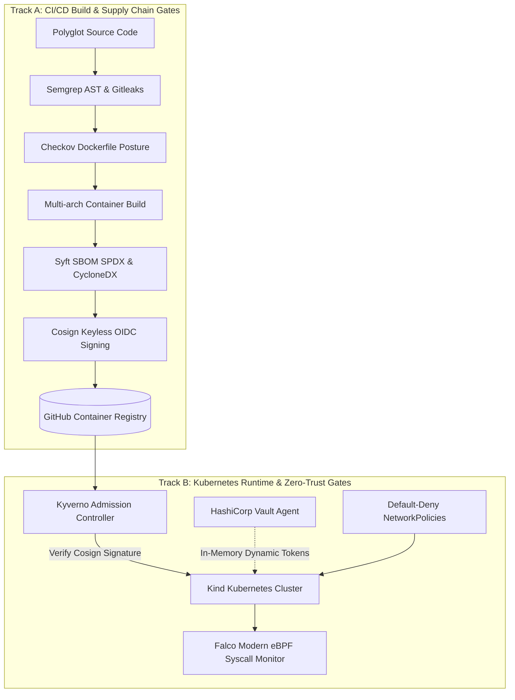

# Enterprise Polyglot DevSecOps Reference Platform

[](https://github.com/jason-victor1/enterprise-devsecops-platform/actions/workflows/security-gates.yml)
[](https://github.com/jason-victor1/enterprise-devsecops-platform/actions/workflows/build-sign-publish.yml)
[](LICENSE)
[](https://github.com/jason-victor1/enterprise-devsecops-platform)

A production-grade, zero-trust reference architecture demonstrating defense-in-depth across 7 polyglot microservices (Go, Python, Node.js, Ruby, Java, C#, PHP).



## Security Architecture & Defensive Gates

| Module | Control Layer | Implementation & Tooling | Threat Vector Mitigated |
| :--- | :--- | :--- | :--- |
| **01. Workload Hardening** | Minimal Distroless Runtimes | Chainguard / Distroless base images, UID `65532` | Shell injection, privilege escalation |
| **02. Static Defense** | AST & Secret Gates | Gitleaks pre-commit, Semgrep AST SAST | Accidental credential leakage, unsafe deserialization |
| **03. Supply Chain** | Provenance & Attestation | Cosign ECDSA signatures, Syft SPDX SBOMs | Image tampering, unauthorized dependencies |
| **04. Secret Governance** | Dynamic In-Memory Secrets | HashiCorp Vault Agent sidecar, `tmpfs` RAM mounts | Secret sprawl, process environment variable leakage |
| **05. Network & Admission** | Zero-Trust & Admission | Default-deny NetworkPolicies, Kyverno admission webhooks | Lateral network pivoting, unsigned workload execution |
| **06. Runtime Detection** | Kernel Threat Observability | Falco modern eBPF syscall engine | Interactive container breakout (`execve`) |

## Automated Adversarial Verification

The platform includes an automated 6-drill regression test harness (`tests/adversarial-suite.sh`) verifying fail-closed execution across both Track A (build pipeline) and Track B (runtime cluster):

```bash
./tests/adversarial-suite.sh
```

## Quickstart & Local Reproduction

1. **Cluster Provisioning**:
   ```bash
   kind create cluster --name devsecops-cluster
   bash k8s/vault/setup-vault.sh
   ```

2. **Deploy Workloads & Zero-Trust Policies**:
   ```bash
   kubectl apply -f k8s/deployments.yaml
   kubectl apply -f k8s/network-policies.yaml
   ```

3. **Install Admission & Observability Stack**:
   ```bash
   helm install kyverno kyverno/kyverno -n kyverno --create-namespace --set admissionController.replicas=1
   kubectl apply -f k8s/kyverno/verify-images-policy.yaml
   helm install falco falcosecurity/falco -n falco --create-namespace --set driver.kind=modern_ebpf --set tty=true
   ```

4. **Execute Adversarial Suite**:
   ```bash
   ./tests/adversarial-suite.sh
   ```
